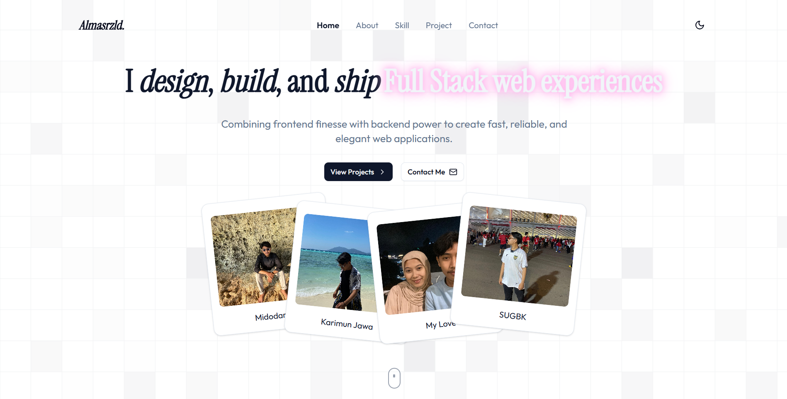
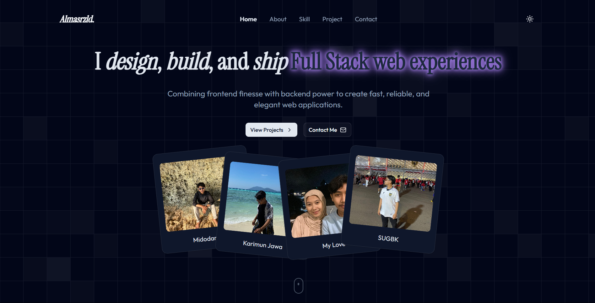

# 🧑‍💻 Portfolio - Almas Rizaldi

Ini adalah project website **portofolio pribadi** yang dibuat menggunakan **Next.js 14+**, **Tailwind CSS**, dan beberapa library pendukung seperti **Framer Motion**, **ShadCN UI**, dan **Lucide Icons**. Website ini menampilkan informasi pribadi, proyek yang pernah dibuat, dan kontak untuk keperluan profesional.

## ✨ Demo

🔗 [https://almasrzld-portofolio.vercel.app/]

## 🛠️ Teknologi yang Digunakan

- [Next.js](https://nextjs.org/)
- [Tailwind CSS](https://tailwindcss.com/)
- [Framer Motion](https://www.framer.com/motion/)
- [Lucide Icons](https://lucide.dev/)
- [shadcn/ui](https://ui.shadcn.com/)
- [TypeScript](https://www.typescriptlang.org/)

## 📂 Struktur Folder

```bash
.
├── app
│   ├── layout.tsx       # Root layout
│   ├── page.tsx         # Landing page utama
│   └── globals.css      # Tailwind base styles + custom themes
├── components
│   ├── common           # Splash screen
│   ├── layout           # Navbar, Footer, ThemeProvider
│   ├── magicui          # Animated grid pattern
│   ├── ui               # Button, Badge, dsb. (shadcn/ui)
├── features
│   ├── About
│   ├── Contact
│   ├── Hero
│   ├── Project
│   ├── Skill
├── lib
│   └── utils.ts
├── public
│   ├── images
│   └── CV_Muhammad-Almas-Rizaldi.pdf
├── README.md
└── ...
```

## 📸 Cuplikan




## 🚀 Cara Menjalankan Project

1. **Clone repo ini**

```bash
git clone https://github.com/almasrzld/portfolio.git
cd portfolio
```

2. **Install dependencies**

```bash
npm install
# atau
yarn
```

3. **Jalankan development server**

```bash
npm run dev
# atau
yarn dev
```

Buka [http://localhost:3000](http://localhost:3000) untuk melihat hasilnya.

## 📌 Fitur Unggulan

- 💡 Dark & Light Mode (dengan switch)
- 🧭 Scroll Spy untuk navigasi aktif
- 💨 Animasi framer-motion saat scroll
- 🔗 Tombol Live Demo & GitHub pada setiap project
- 🧩 Komponen reusable dengan shadcn/ui
- 🎨 Custom theme dengan warna berbasis OKLCH

## 🤝 Kontak

- ✉️ Email: [almasrzld@gmail.com](mailto:almasrzld@gmail.com)
- 💼 LinkedIn: [linkedin.com/in/almas-rizaldi-816812300](https://linkedin.com/in/almas-rizaldi-816812300)
- 💻 GitHub: [github.com/almasrzld](https://github.com/almasrzld)

---

> Dibuat dengan semangat dan ketelitian. Terima kasih sudah melihat repo ini 🙏
